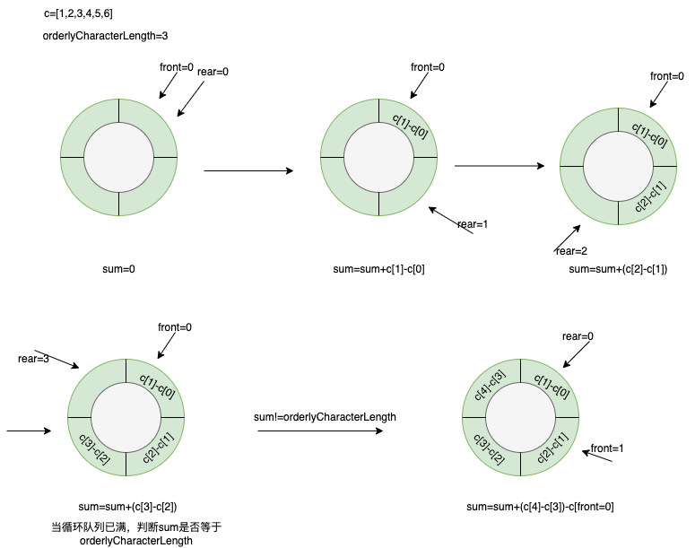

## passay-orderly-character-rule
Passay是一个基于Java的密码生成和验证库，它提供了全面的功能列表已验证/生成密码，并且高度可配置。

本案例是基于Passay现有Rule进行扩展，用于校验密码连续有序字符长度。例如密码`Admin123456`中存在连续的有序字符`123456`。
其次，本规则有序字符包含范围[1-9][a-z][A-Z]。

### 实现原理
基于循环队列实现

